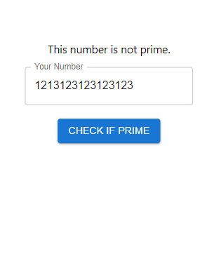

# Youtube Example
This is a React + Express web application that calculates primes up to a certain point.

## Development

We can run the dev front end by running `npm start` in the root directory. 
We can run the backend using `npm run dev` in the `api` directory. 

## Production
The production server is entirely run out of the `api` directory. You can start
the production server by running `npm run build` in the root directory then 
`npm start` in the `api` directory. This was written on linux so the start 
command will not run on windows. You can just set the `PRODUCTION=true` 
variable when running on windows before running `npm run build`.

## Deployment
This deploys to a non-scalable server. You need to:

1. Create a new user
2. Create a ssh key-pair for that user
3. Store username, IP, and key-pair in the repo
4. Pull the repo for the first time on the server.
5. Set up apache to reverse proxy the application.

Once this is set up the server will automatically be refreshed on pushes to
the main branch. If your sever is too small (like in my case) it will run out
of memory on the build so that is something that needs to be taken into account.